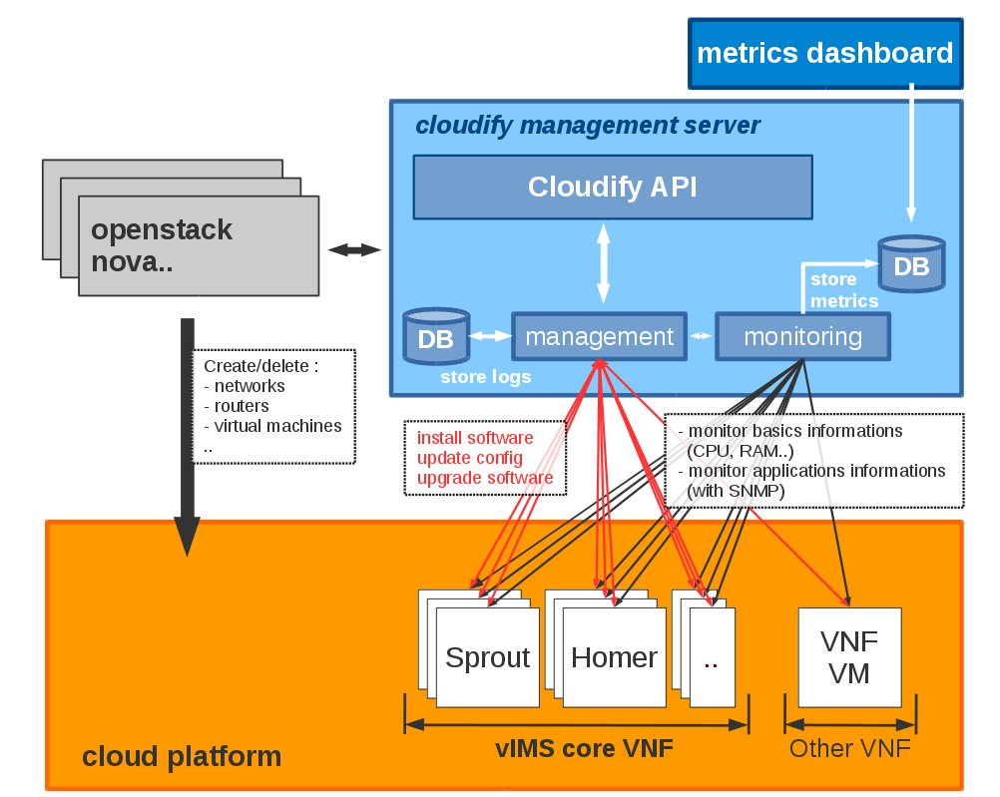

# Cloudify clearwater Get Starting Installation

vIMS **Clearwater** deployment and lifecycle management with **Cloudify** Orchestrator

## Introduction
This repo contains the **TOSCA** file and the scripts to deploy and manage a MetaSwitch/**Clearwater** vIMS on **OpenStack** platform.

It aims to propose a full **life-cycle management** of this vIMS.

The application description is done with **TOSCA** description file and the configuration is  done with **Bash scripts** and **Python scripts**.

To deploy **clearwater** vIMS many solution already exist like :
* Use [Chef](https://www.chef.io/chef/) with these [recipes](https://github.com/Metaswitch/chef)
* Use [Juju](https://jujucharms.com/) with this [charms](https://github.com/Metaswitch/clearwater-juju/)
* Use [Docker](https://www.docker.com/) with these [Dockerfiles](https://github.com/Metaswitch/clearwater-docker)
* Use [OpenStack Heat](https://wiki.openstack.org/wiki/Heat) with these [templates](https://github.com/Metaswitch/clearwater-heat)

But some of these solutions don't manage full **life-cycle management** of this application. Life-cycle management this is the **deployment** of this application but also the **monitoring**, **healing**, **scaling** or again the **software upgrade**.

The **Cloudify** ochestrator can manage full application life-cycle. For the moment, only one open-source [code](http://getcloudify.org/2014/11/02/NFV-openstack-TOSCA-open-source-cloud-Chef.html) exist to deploy Clearwater with Cloudify **and** Chef. But the best way to benefit fully features from cloudify is to use cloudify not with chef but with python and bash scripts to install and configure the application (**VNF**).

See Clearwater management part to deploy this vIMS !

## Architecture

## Clearwater management

Before deploy clearwater, you must have deployed cloudify manager server. To do this, follow this [documentation](docs/cloudify.md).

Then, you can deploy, monitor, scale and test the clearwater vIMS by following this [documentation](docs/clearwater.md).

## OPNFV

This blueprint is used in OPNFV functest project.  The goal of Functest consists in providing comprehensive testing methodology, test suites and test cases to test and verify OPNFV Platform functionality that covers the VIM and NFVI components. [See](https://wiki.opnfv.org/opnfv_functional_testing) for details on OPNFV/functest !

In the first release (called Arno), first test suites were focused on the VIM, NFVI and SDN controller through the integration of existing upstream test suites (OpenStack and ODL). The vIMS testcase was also initially planned but finally not integrated.
In the second release (called Brahmaputra), vIMS is considered as a candidate VNF for functional testing.

The goal of this test case consists in deploying and automatically testing a distributed vIMS based on clearwater solution within the OPNFV continuous integration.
This test will provide interesting information on the deployment as well as KPI on the functional test suites. In a first step no performance tests are expected but they could be introduced later.

The different step for the continuous Integration can be summarized as follow :
* The preparation of the testing environement including the creation of a dedicated vIMS tenant
* The deployment of the cloudify manager on the target OPNFV platform  ;
* The deployment of clearwater vIMS solution with cloudify manager;
* The launch of a function test suite;
* The test, log and monitoring information collection
* The cleaning ot the tenant 

## License

[Apache License 2.0](./LICENSE)